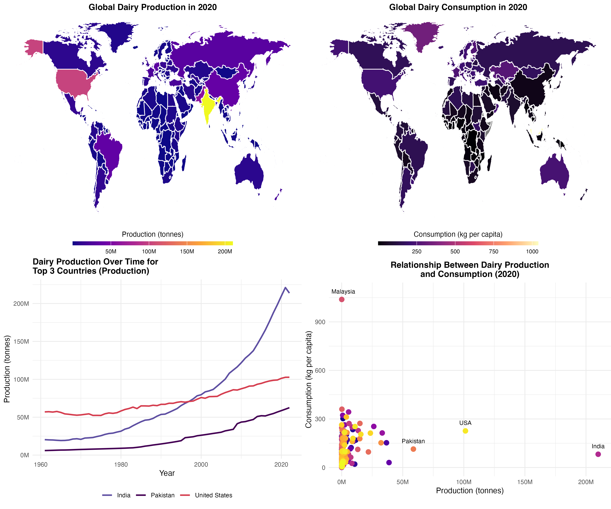
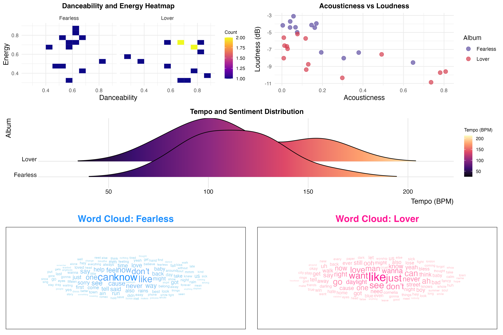
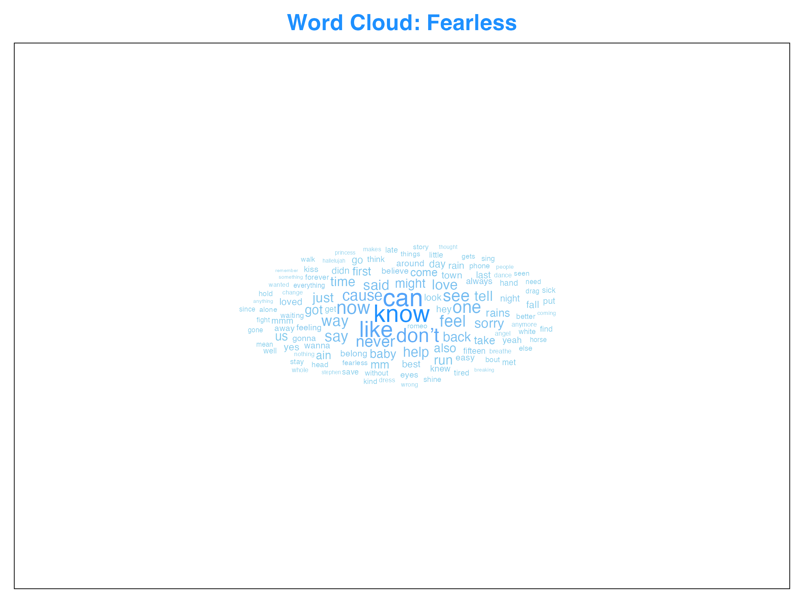
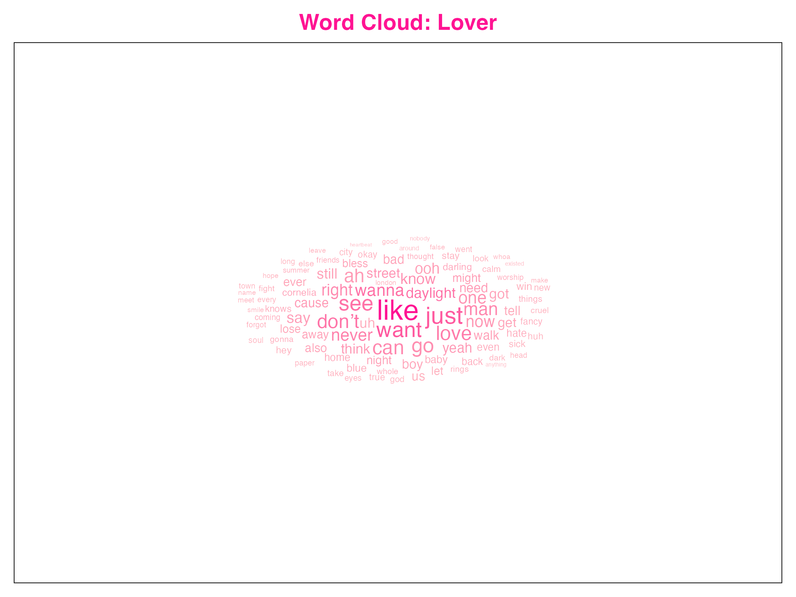
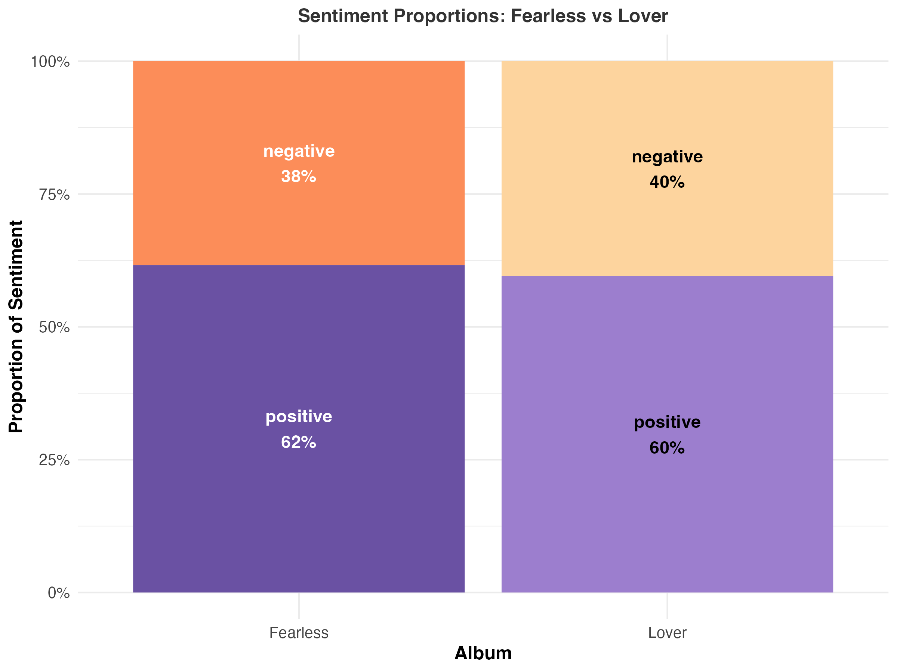
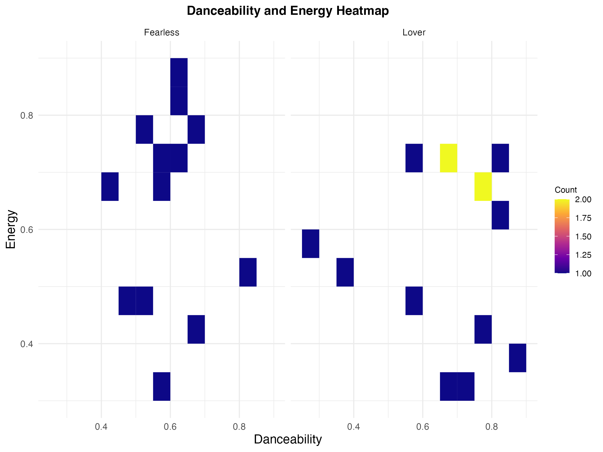
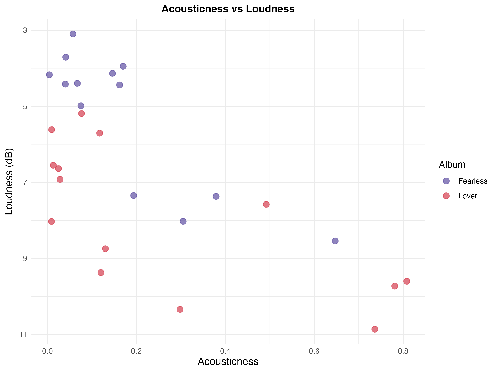
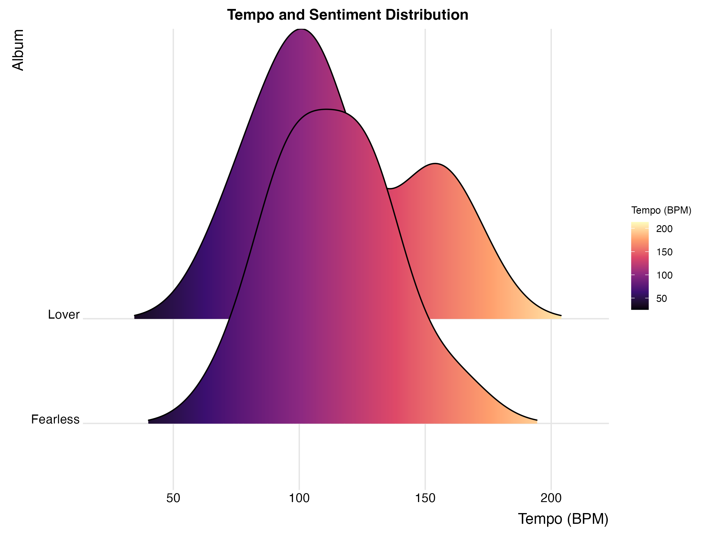

# STA309 Midterm 2: Milk and Melody

**Author**: Hera Dashnyam  
**Date**: November 13, 2024  

This project contains dashboards analyzing **global dairy production and consumption** as well as a **lyrical and musical comparison of Taylor Swift’s albums "Fearless" and "Lover."**

---

## Important Note:
**For the best experience and detailed visuals, it is highly recommended to view the full analysis and visualizations in the R Markdown file (`MIDTERM2-Hera-Dashnyam.Rmd`).** The README provides an overview, but the R Markdown file contains additional context, interactivity, and better formatting for the visualizations.

---

## Problem 1: Dairy Production and Consumption Analysis

This part of the project provides a global perspective on dairy production and consumption patterns using data from the Food and Agriculture Organization (FAO). The analysis includes:

1. **Global Dairy Production in 2020**:
   - A world map highlighting production in tonnes by country.
   - High-producing countries like the USA and India stand out.

2. **Global Dairy Consumption in 2020**:
   - A world map visualizing per capita milk consumption.
   - European countries show higher per capita consumption levels.

3. **Dairy Production Trends Over Time**:
   - Line chart showing trends for top-producing countries: USA, India, and Pakistan.
   - Highlights India’s rapid increase in production since the 2000s.

4. **Production vs. Consumption Relationship**:
   - Scatter plot analyzing how production correlates with consumption.
   - Identifies outliers like Malaysia (high consumption, low production).

---

## Problem 2: Taylor Swift Albums Analysis

A lyrical and musical comparison of two of Taylor Swift’s iconic albums, *Fearless* (reflective, emotional) and *Lover* (romantic, upbeat), was conducted using Spotify and lyrics data. Key components:

### Full Taylor Swift Dashboard:
This dashboard combines all the visualizations for the Taylor Swift analysis in a single display:

### Individual Plots:
1. **Word Clouds**:
   - Visualizations for the most frequently used words in each album.
   - *Fearless*: Cooler blue tones reflect its introspective themes.
   - *Lover*: Warmer pink tones align with its joyful and romantic nature.

    

2. **Sentiment Analysis**:
   - Bar chart comparing positive and negative sentiment proportions.
   - *Fearless*: Dominated by positive sentiment (62%).
   - *Lover*: A balance of positivity and introspection (60% positive, 40% negative).

   

3. **Musical Attributes**:
   - **Danceability & Energy Heatmap**: Visualizing the density of songs with high danceability and energy.
     
   - **Acousticness vs. Loudness**: Highlights the acoustic, country roots of *Fearless* versus the pop polish of *Lover*.
     
   - **Tempo Distribution**: A ridgeline plot showing *Lover*’s faster tempos compared to the balanced pace of *Fearless*.
     

The dashboard effectively contrasts the thematic and stylistic evolution of Taylor Swift’s music.

---

## Repository Structure

- `README.md`: Project overview and description (this file).
- `MIDTERM2-Hera-Dashnyam.Rmd`: The R Markdown file containing all the code and analysis. **This file is preferred for viewing full-quality visuals and interactive elements.**
- PNG files: All plots used in the dashboards:
  - `dairy_dashboard.png`
  - `heatmap_plot.png`
  - `tempo_sentiment_plot.png`
  - `acousticness_loudness_plot.png`
  - `sentiment_plot.png`
  - `fearless_wordcloud.png`
  - `lover_wordcloud.png`
  - `taylor_swift_dashboard.png`

---

This README provides a concise overview of the project, but for a more in-depth analysis and better visual clarity, please view the `MIDTERM2-Hera-Dashnyam.Rmd` file.
